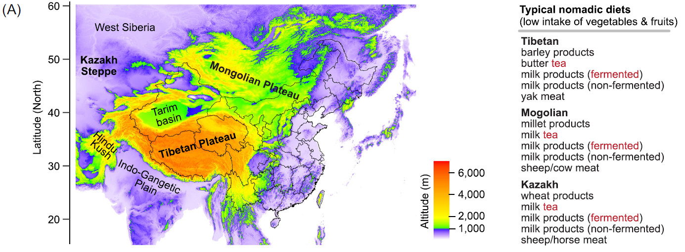

```{css include=FALSE}
 pre code,pre,code {
 white-space:pre!important;
 overflow-x: scroll!important; 
} 
```

```{r setup, include=FALSE}
knitr::opts_chunk$set(
	echo = TRUE,
	fig.align = "center",
	fig.height = 5,
	fig.width = 7,
	message = FALSE,
	warning = FALSE
)
```


## iMeta教你绘图系列

基于数据分析与绘图，大部分相关领域的研究者目前使用了R语言，这也是当前最流行、比较容易使用，学习和使用性价比较高的语言。通过对作者分析过程的代码重现，往往可以更深入的理解文章中的深层含义，通过代码设计的顺序和写法，可以了解作者分析过程的思路变化还有风格。

### 世界海拔地图

今为大家分享世界海拔地图的绘制，此图的数据来自iMeta 2022年2月发表文章的图1A。详见：[iMeta | 吴青龙/王明福/刘金鑫等-从肠道菌群看待人类对高原饮食的适应性](https://mp.weixin.qq.com/s/0hCtXD3HfZL-wBz4aGXpWg)。

原文数据和代码：https://github.com/qinglong89/Nomad-Prevotella

本文通过对作者提供的代码和数据进行测试和注释，方便大家学习。

整理后的代码详见：https://github.com/iMetaScience/iMeta 中 MapElevation 目录

#### 图及描述



图1 游牧地区人群的Prevotella 肠型具有较高的微生物多样性。(A) 主要游牧地区的地理位置和人类膳食特征。

Figure 1. Gut Prevotella enterotype of high microbial diversity in people of nomadic regions. (A) Geographic location and dietary patterns of major nomadic regions.

经历了长期的饮食选择，黑茶成为高原和低海拔草原地区游牧民族饮食中的重要组成部分(图1A)。值得注意的是，食用发酵奶制品也是游牧民族几千年来的一种传统饮食(图1A)。

Through long-term dietary self-selection, dark tea becomes an essential part of nomadic diets in high plateaus and low-altitude steppe areas (Figure 1A). Of note, consumption of fermented milk products is a tradition for thousands of years in nomadic diets (Figure 1A). 

有趣的是，在藏族人、蒙古族人和哈萨克族人中，茶和发酵奶的摄入高且频繁(图1A)，然而单纯地将这种饮食习惯与低炎症水平联系起来是值得怀疑的，需要设计一个系统的饮食干预来证实。

It is quite interesting to see the frequent consumption of tea and fermented milk in Tibetan, Mongolian, and Kazakh populations (Figure 1A), but linking such dietary habits to reduced inflammation is questionable and requires a systematic design of diet intervention to confirm it.


#### 代码解读

目前微生物生态学研究内卷严重，越来越多的研究趋向于大数据，大范围，多分析，多层次。往往大范围就涉及到了地图。我国对于涉及地图的出版物管理往往比较严格，虽然科学论文中不存在其他争议，但是尽量在地图绘制过程中尽量不要添加国界线等人为设定的区分内容。

这里使用raster包进行分析遥感数据处理：raster包是基于rgdal底层库编写的地理数据处理包，包括图像的创建，图像的读取，图像的运算，图像的可视化，图像的输出。

```{R}
# library加载包：raster是地理数据分析包，ggplot2是绘图包
library(raster)
library(ggplot2)

# 下载地图数据：https://biogeo.ucdavis.edu/data/climate/worldclim/1_4/grid/cur/alt_2-5m_bil.zip
elevation_world <- getData('worldclim', var='alt', res=2.5)
# 无法自动下载，可手动下载并指定位置加载
# elevation_world <- getData('worldclim', download=FALSE, path="./", var='alt', res=2.5)

# 绘图世界海拔图预览
plot(elevation_world$alt)
```

```{R}
# 转换地图数据为数据框
# coerce class 'structure("RasterLayer", package = "raster")' to a data.frame
df <- data.frame(rasterToPoints(elevation_world$alt))
# 预览：经、纬度及海拔
head(df)

# 绘制世界海拔图，指定色阶 world elevation map
ggplot(df, aes(x=x, y=y)) +
  # 绘图矩形填充图，类似热图
  geom_raster(aes(fill=alt)) +
  # 手动指定热图由小到大的颜色及对应的梯度
  scale_fill_gradientn(colours = c("gray", "blue", "green", "yellow", "red"),
                       values = scales::rescale(c(0, 0.133, 0.266, 0.4, 1))) +
  # 图例的字号和字体
  theme(legend.text=element_text(size=18),
        legend.title=element_text(size=14,face="bold"),
        axis.line = element_line(colour = "black"), 
        panel.background = element_rect(fill = 'white', colour = 'black'))


# 选择亚洲区域，可右侧zoom放在选择合适的范围
df_asia <- subset(df, x>60 & x<145 & y>15 & y<60) #focus on Asia

# 绘制亚洲区域
p = ggplot(df_asia, aes(x=x, y=y)) +
  geom_raster(aes(fill=alt)) +
  scale_fill_gradientn(colours = c("white", "blue", "green", "yellow", "red"),
                       values = scales::rescale(c(0, 0.137, 0.138, 0.276, 1))) +
  theme(legend.text=element_text(size=18),
        legend.title=element_text(size=14,face="bold"),
        axis.line = element_line(colour = "black"), 
        panel.background = element_rect(fill = 'white', colour = 'black'))
# 预览
p

# 保存PDF矢量图，文字可编辑
ggsave("3MapAsia.pdf", p, width = 183, height = 118, units = "mm")
# 保存eps格式是矢量图，但AI编辑中白色背景显示为黑，文字栅格化为图形不可调整字体和字号 
ggsave("3MapAsia.eps", device=cairo_ps)
```

使用本教程，请引用：

Yina Huang, Jinxin Liu, Hein Min Tun, Catherine Stanton, Tingtao Chen, Hani El-Nezami, Hua Wei, Mingfu Wang, Qinglong Wu. 2022. Gut microbiota insights into human adaption to high-plateau diet. **iMeta** 1: e6. https://doi.org/10.1002/imt2.6

## 小知识：EPS格式

EPS 格式：EPS 文件格式是 Encapsulated PostScript 的首字母缩写词。它可以包含图形、插图或文本文件。它还可以作为编码的不同点和公式，并且相对更灵活和可调整大小。

*优点：*

- EPS 文件可以调整为任何尺寸而不会降低其质量，此属性在打印大尺寸图像时特别有用。
- 非常适合导入到其他几个图形应用程序和软件中。
- 使用范围非常广泛。EPS 文件可以包含和组合图像、文本和插图，具有很大的可行性。
- EPS 文件受多种文字处理软件的支持，并与 Windows 和 Mac 兼容。

*缺点：*

- 大多数操作系统通常不支持 EPS 文件格式。
- EPS 文件的最低分辨率为 300 dpi，以保持其质量。
- 这些文件可能需要时间来自定义和保存。
- 页面布局应用程序通常不支持 EPS 文件修改，因此需要将文件保存为最终草稿。


