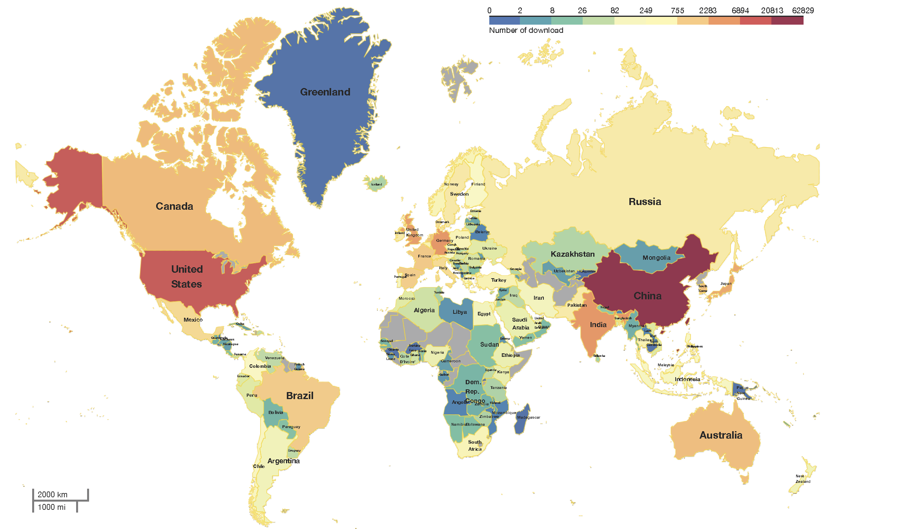
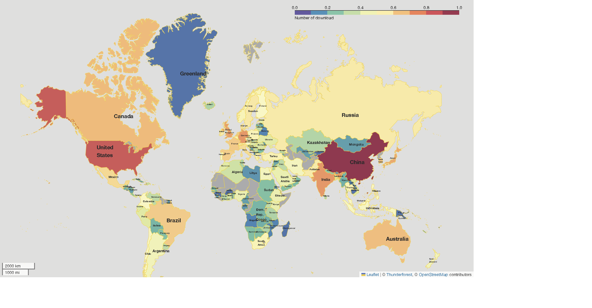
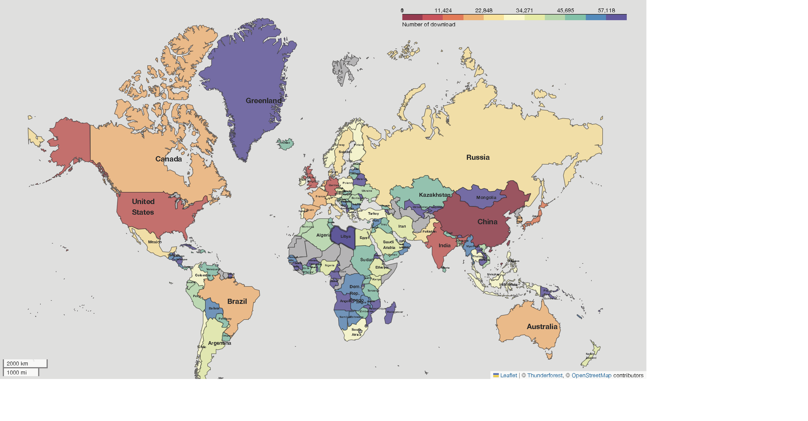

# folium_documentation



# script link
[plot_world_map.ipynb](plot_world_map.ipynb)


# 安装python包folium

```python
#!pip install folium #用来画世界地图
#!pip install geopandas #用来处理和读取世界地图数据（geojson）
```

# 导入本脚本需要用到的python包


```python
import pandas as pd
import folium,branca
from folium.features import DivIcon
import geopandas
import matplotlib
import matplotlib.pylab as plt
import numpy as np
import branca.colormap as cm
```

# 读取数据

## 读取每个国家下载量数据
这里需要注意，国家会对每个出版的地图进行审核，台湾、香港和南海诸岛必须要要属于中国，所以，需要对原始数据进行处理，将台湾、香港、澳门的数据合并到中国。

<!-- # The URL we will read our data from
url = 'https://en.wikipedia.org/wiki/Divorce_demography'
# read_html returns a list of tables from the URL
tables = pd.read_html(url)
# The data is in the second table
table = tables[1]
# We need to remove level 0 of columns as they are disturbing the data
table.columns = table.columns.droplevel(0)
# We should clean the data
table['Country'] = table.apply(lambda row: row['Country/region'].split(' (')[0] if type(row['Country/region']) == str else row['Country/region'], axis=1)
table -->


```python
df=pd.read_excel(os.path.expanduser("data.xlsx"))
#merge China main land, Hongkong, Taiwan and Macao.
df.loc[df.CountryName=='China','Count']= df.loc[df.CountryName.isin(['China','Hong Kong','Taiwan','Macao']),'Count'].sum()
df=df.loc[~ df.CountryName.isin(['Hong Kong','Taiwan','Macao'])]
#为了使数据中的国家名字与后面的地图数据中的国家名字匹配，需要将部分国家的名字替换为地图数据中的名字
df.CountryName.replace({'Iran, Islamic Republic of...':'Iran',
                       'Russian Federation':'Russia','Sri Lanka':'Srilanka',
                       'Venezuela, Bolivarian Republic of...':'Venezuela',
                       'The former Yugoslav Republic of Macedonia':'North Macedonia','Syrian Arab Republic':'Syria',
                        'Brunei Darussalam':'Brunei','Republic of Moldova':'Moldova',
                        'Congo, Democratic Republic':'Dem. Rep. Congo',"Lao People's Democratic Republic":'Laos',
                        'Libyan Arab Jamahiriya':'Libya','South Sudan':'S. Sudan',
                       'United Republic of Tanzania':'Tanzania',
                        'Bosnia and Herzegovina':'Bosnia And Herzegovina',"Korea,Democratic People'S Republic Of":'North Korea',
                       },
                       inplace=True)
print(df.CountryName.unique())
```

    ['China' 'United States' 'India' 'Germany' 'United Kingdom' 'Japan'
     'Canada' 'Australia' 'South Korea' 'Netherlands' 'Singapore' 'France'
     'Brazil' 'Spain' 'Mexico' 'Italy' 'Denmark' 'Switzerland' 'Sweden'
     'Pakistan' 'Russia' 'Ireland' 'Israel' 'Belgium' 'Thailand' 'Turkey'
     'Norway' 'South Africa' 'Poland' 'Chile' 'Colombia' 'Finland' 'Malaysia'
     'Austria' 'Philippines' 'Greece' 'Portugal' 'Indonesia' 'Iran' 'Egypt'
     'Czech Republic' 'Argentina' 'New Zealand' 'United Arab Emirates'
     'Ethiopia' 'Nigeria' 'Saudi Arabia' 'Kenya' 'Ukraine' 'Estonia' 'Morocco'
     'Peru' 'Viet Nam' 'Bangladesh' 'Ecuador' 'Croatia' 'Hungary' 'Luxembourg'
     'Romania' 'Unknown' 'Algeria' 'Ghana' 'Panama' 'Puerto Rico' 'Uruguay'
     'Cyprus' 'Iraq' 'Serbia' 'Dominican Republic' 'Venezuela' 'Uganda'
     'Slovakia' 'Slovenia' 'Lithuania' "Cote d'Ivoire'" 'Georgia' 'Kuwait'
     'Kazakhstan' 'Zimbabwe' 'Tanzania' 'Iceland' 'Tunisia' 'Srilanka'
     'Jordan' 'Qatar' 'Nepal' 'Benin' 'Seychelles' 'Yemen' 'North Macedonia'
     'Lebanon' 'Paraguay' 'Sudan' 'Jamaica' 'Trinidad and Tobago' 'Costa Rica'
     'Botswana' 'Bulgaria' 'Namibia' 'Malta' 'Oman'
     'Palestinian Territory, Occupied' 'Senegal' 'Bolivia' 'Dem. Rep. Congo'
     'Bahrain' 'Myanmar' 'Reunion' 'Guatemala' 'Zambia' 'Syria' 'Martinique'
     'New Caledonia' 'Malawi' 'Latvia' 'Bosnia And Herzegovina' 'Honduras'
     'Cameroon' 'Mongolia' 'Cuba' 'Nicaragua' 'Mauritius' 'Maldives' 'Brunei'
     'Uzbekistan' 'Moldova' 'Armenia' 'Eritrea' 'Montenegro' 'Libya'
     'French Guiana' 'Sierra Leone' 'Gabon' 'Liechtenstein' 'Togo' 'Belize'
     'Belarus' 'Laos' 'Bhutan' 'Mozambique' 'Bahamas' 'Albania' 'Angola'
     'Barbados' 'Fiji' 'Guadeloupe' 'Burkina Faso' 'Papua New Guinea'
     'Vanuatu' 'Rwanda' 'Falkland Islands (Malvinas)' 'Madagascar' 'Andorra'
     'Cape Verde' 'S. Sudan' 'Cambodia' 'Kyrgyzstan'
     'EUROPE - UNKNOWN COUNTRY' 'El Salvador' 'Greenland' 'Aruba' 'Guinea']


## 读取世界地图数据
这里，使用geopandas读取中科院全球国家行政边界数据, <br>
地图数据下载网址：https://www.resdc.cn/Default.aspx，<br>
选择【全球100万基础地理数据】分类下面的【全球国家行政边界数据】下载解压。<br>
<br>
需要注意的是，从其它地方下载的世界地图（大多来自西方国家），西藏的边界线是有问题的，跟国家官方给的边界线不一致，如果用那些数据来画图，审核肯定无法通过。还有台湾、钓鱼岛和南海诸岛。所以，我们最后使用的是中科院提供的世界地图数据来画图。


```python
# Read the geopandas dataset
data = geopandas.read_file("世界国家.shp")
data.crs="epsg:4326"
data.to_crs(crs="epsg:3857")
data.to_file('World.geojson', driver='GeoJSON')
#国家名字每个单词首字母大写
data.NAME=data.NAME.apply(lambda x:x.title() if not pd.isna(x) else np.nan)
data.NAME.replace({'Russian Federation':'Russia','Cote D¡¯Ivoire':"Cote D'Ivoire'",
                  "Korea,Democratic People'S Republic Of":'North Korea',
                   'Macedonia,The Former Yugoslav Republic Of':'North Macedonia',
                   'Syrian Arab Republic':'Syria','Korea, Republic Of':'South Korea',
                   'Congo,The Democratic Republic Of The':'Dem. Rep. Congo',
                   'United States of America':'United States'
                  },inplace=True)
#讲下载量数据中的国家名字也做同样的处理
df.CountryName=df.CountryName.apply(lambda x:x.title() if not pd.isna(x) else np.nan)
#把两个数据框拼接起来，拼接后的数据框，既包含世界地图坐标数据，也包含我们需要展示的数据（下载量）
data = data.merge(df, how="left", left_on=['NAME'], right_on=['CountryName'])
print(data.NAME.unique())
data.drop('geometry',axis=1).head() 
#geometry这一列包含每个国家的坐标和边界信息，非常庞大，所以就不展示geometry这一列了
```

    [nan 'Greenland' 'Canada' 'United States' 'Saint Pierre And Miquelon'
     'Bermuda' 'Bahamas' 'Turks And Caicos Islands' 'Cuba' 'Mexico'
     'Cayman Islands' 'Haiti' 'Puerto Rico' 'Virgin Islands,British'
     'Dominican Republic' 'Virgin Islands,U.S.' 'Anguilla' 'Jamaica'
     'Saint Kitts And Nevis' 'Antigua And Barbuda' 'Montserrat' 'Belize'
     'Guadeloupe' 'Guatemala' 'Dominica' 'Martinique' 'Nicaragua'
     'Saint Lucia' 'El Salvador' 'Honduras' 'Barbados'
     'Saint Vincent And The Grenadines' 'Aruba' 'Colombia' 'Grenada'
     'Netherlands Antilles' 'Trinidad And Tobago' 'Costa Rica' 'France'
     'Panama' 'Marshall Islands' 'Palau' 'Kiribati' 'Nauru' 'Solomon Islands'
     'Papua New Guinea' 'Cook Islands' 'American Samoa' 'Australia' 'Vanuatu'
     'Fiji' 'Tonga' 'Niue' 'New Caledonia' 'Pitcairn' 'Norfolk Island'
     'Heard Island And Mcdonald Islands' 'Bouvet Island'
     'Northern Mariana Islands' 'Antarctica'
     'South Georgia And The South Sandwich Islands' 'Tuvalu' 'Tokelau'
     'French Polynesia' 'French Southern Territories' 'Samoa'
     'Micronesia,Federated States Of' 'Wallis And Futuna'
     'Cocos(Keeling) Islands' 'Prince Edward Island' 'New Zealand'
     'Wake Island' 'Algeria' 'Tunisia' 'Libya' 'Morocco' 'Egypt'
     'Western Sahara' 'Mali' 'Mauritania' 'Niger' 'Sudan' 'Senegal'
     'Cape Verde' 'Ethiopia' 'Gambia' 'Burkina Faso' 'Eritrea' 'Guinea-Bissau'
     'Djibouti' 'Guinea' 'Chad' 'Nigeria' "Cote D'Ivoire'"
     'Central African Republic' 'Ghana' 'Sierra Leone' 'Benin' 'Togo'
     'Liberia' 'Cameroon' 'Uganda' 'Equatorial Guinea' 'Congo'
     'Sao Tome And Principe' 'Gabon' 'Somalia' 'Rwanda' 'Kenya'
     'Dem. Rep. Congo' 'Burundi' 'Tanzania' 'Angola' 'Seychelles' 'Malawi'
     'Mayotte' 'Zambia' 'Madagascar' 'Mozambique' 'Mauritius' 'Zimbabwe'
     'Reunion' 'Namibia' 'Botswana' 'Swaziland' 'Lesotho' 'South Africa'
     'Saint Helena' 'Comoros' 'Canarias' 'Madeira' 'Venezuela' 'Guyana'
     'Suriname' 'French Guiana' 'Ecuador' 'Brazil' 'Bolivia' 'Peru' 'Paraguay'
     'Argentina' 'Uruguay' 'Chile' 'Falkland Islands(Malvinas)'
     'Svalbard And Jan Mayen' 'Russia' 'Sweden' 'Iceland' 'Norway'
     'Faroe Islands' 'Finland' 'United Kingdom' 'Estonia' 'Latvia' 'Lithuania'
     'Denmark' 'Belarus' 'Germany' 'Netherlands' 'Poland' 'Ireland' 'Belgium'
     'Luxembourg' 'Czech Republic' 'Slovakia' 'Moldova' 'Austria' 'Hungary'
     'Switzerland' 'Liechtenstein' 'Slovenia' 'Romania' 'Serbia' 'Ukraine'
     'Bosnia And Herzegovina' 'Croatia' 'San Marino' 'Monaco' 'Italy'
     'Bulgaria' 'Andorra' 'North Macedonia' 'Montenegro' 'Vatican' 'Albania'
     'Greece' 'Gibraltar' 'Malta' 'Portugal' 'Spain' 'Turkmenistan'
     'Kyrgyzstan' 'Armenia' 'Syria' 'Lebanon' 'Afghanistan' 'Iraq' 'Kuwait'
     'Nepal' 'Bhutan' 'Laos' 'Maldives' 'Brunei' 'East Timor'
     'Christmas Island' 'Mongolia' 'Caspian Sea' 'Jordan' 'Bahrain' 'Qatar'
     'Georgia' 'Israel' 'Cyprus' 'Iran' 'Pakistan' 'Azerbaijan' 'Yemen'
     'Bangladesh' 'Singapore' 'Kazakhstan' 'Area Under Dispute' 'Cambodia'
     'Srilanka' 'British Indian Ocean Territory' 'Tajikistan' 'Saudi Arabia'
     'Myanmar' 'Japan' 'South Korea' 'United Arab Emirates' 'Malaysia' 'India'
     'Indonesia' 'Philippines' 'Oman' 'Thailand' 'Uzbekistan' 'Turkey'
     'North Korea' 'Viet Nam' 'China']


<div>
<style scoped>
    .dataframe tbody tr th:only-of-type {
        vertical-align: middle;
    }

    .dataframe tbody tr th {
        vertical-align: top;
    }

    .dataframe thead th {
        text-align: right;
    }
</style>
<table border="1" class="dataframe">
  <thead>
    <tr style="text-align: right;">
      <th></th>
      <th>OBJECTID</th>
      <th>NAME</th>
      <th>FENAME</th>
      <th>FCNAME</th>
      <th>SOC</th>
      <th>POP</th>
      <th>ELEMID</th>
      <th>SHAPE_LENG</th>
      <th>SHAPE_AREA</th>
      <th>ID1</th>
      <th>CountryName</th>
      <th>Count</th>
    </tr>
  </thead>
  <tbody>
    <tr>
      <th>0</th>
      <td>1</td>
      <td>NaN</td>
      <td>None</td>
      <td>None</td>
      <td>None</td>
      <td>0.0</td>
      <td>0</td>
      <td>154.008856</td>
      <td>27.507542</td>
      <td>1</td>
      <td>NaN</td>
      <td>NaN</td>
    </tr>
    <tr>
      <th>1</th>
      <td>2</td>
      <td>Greenland</td>
      <td>Greenland</td>
      <td>¸ñÁêÀ¼</td>
      <td>GRL</td>
      <td>6.0</td>
      <td>1</td>
      <td>1359.592591</td>
      <td>662.855357</td>
      <td>2</td>
      <td>Greenland</td>
      <td>1.0</td>
    </tr>
    <tr>
      <th>2</th>
      <td>3</td>
      <td>Canada</td>
      <td>Canada</td>
      <td>¼ÓÄôó</td>
      <td>CAN</td>
      <td>3166.0</td>
      <td>2</td>
      <td>3635.736641</td>
      <td>1692.808594</td>
      <td>3</td>
      <td>Canada</td>
      <td>1763.0</td>
    </tr>
    <tr>
      <th>3</th>
      <td>4</td>
      <td>United States</td>
      <td>United States Of America</td>
      <td>ÃÀ¹ú</td>
      <td>USA</td>
      <td>28837.0</td>
      <td>3</td>
      <td>1261.087368</td>
      <td>1100.995648</td>
      <td>4</td>
      <td>United States</td>
      <td>15479.0</td>
    </tr>
    <tr>
      <th>4</th>
      <td>5</td>
      <td>Saint Pierre And Miquelon</td>
      <td>Saint Pierre and Miquelon</td>
      <td>ʥƤ°£¶ûºÍÃÜ¿Ë¡</td>
      <td>SPM</td>
      <td>1.0</td>
      <td>4</td>
      <td>1.725672</td>
      <td>0.026938</td>
      <td>5</td>
      <td>NaN</td>
      <td>NaN</td>
    </tr>
  </tbody>
</table>
</div>


## 将无法匹配的国家名字打印出来，如果有需要，可以向上面df.CountryName.replace中添加字典的内容来匹配


```python
df.loc[~ df.CountryName.isin(data.NAME.tolist())].CountryName.values
```


    array(['Unknown', 'Palestinian Territory, Occupied',
           'Falkland Islands (Malvinas)', 'S. Sudan',
           'Europe - Unknown Country'], dtype=object)


# 画世界地图
folium.Map的主要参数信息如下：<br>
location： 设定地图中心点<br>
width, height：将地图的宽度和高度进行缩放<br>
tiles： 地图瓦片，参考https://leaflet-extras.github.io/leaflet-providers/preview/ 和 https://juejin.cn/post/7116708374279880734


```python
# Create a map
my_map = folium.Map(title="World Map",location=(50,5),max_zoom=1,control_scale=True,
                    prefer_canvas=True,zoom_control=False,
                    width='80%',height='90%',zoom_start=2.49,#tiles='Stamen Terrain', #Stamen Watercolor
                    # titles="http://map.geoq.cn/ArcGIS/rest/services/ChinaOnlineCommunityENG/MapServer/tile/{z}/{y}/{x}",
                   tiles=folium.TileLayer('https://{s}.tile.thunderforest.com/mobile-atlas/{z}/{x}/{y}.png?apikey={apikey}',
                          attr='&copy; <a href="http://www.thunderforest.com/">Thunderforest</a>, &copy; <a href="https://www.openstreetmap.org/copyright">OpenStreetMap</a> contributors',
                          apikey='pk.eyJ1IjoiZGluZ3diIiwiYSI6ImNsY3doNmluazBmd2Qzb29lbzVrYXltdjYifQ.H8sWvLIDzRD7hbZDYlbUCQ',maxZoom=24,overlay=True)
                   )


data['Y']=data.Count.apply(lambda x:np.log2(x+1) if not pd.isna(x) else np.nan)
max_v = data.Y.max()
def get_color(x,name):
    if pd.isna(name):
        return 'darkgrey'
    if pd.isna(x):
        return 'darkgrey'
    return matplotlib.colors.rgb2hex(plt.get_cmap('Spectral_r')(x/max_v))
    # return cmap(x)

ticks=[]
for i in np.arange(start=0,stop=1.1,step=0.1):
    ticks.append(int(2**(i * max_v) -1))
print(ticks)
cmap = cm.LinearColormap([plt.get_cmap('Spectral_r')(i) for i in np.arange(start=0,stop=1.1,step=0.1)],
                         index=np.arange(start=0,stop=1.1,step=0.1),vmin=0, vmax=1,max_labels=20).to_step(10) #tick_labels=ticks,

cmap.caption="Number of download"
my_map.add_child(cmap)

# add different color to each country according to the number of download
folium.GeoJson(
    data,
    style_function=lambda feature: {
        'fillColor': get_color(feature['properties']['Y'],feature['properties']['NAME']),
        'color': 'gold',
        'fillOpacity':1,
        'opacity':0.7,
        'weight': 1,
        'dashArray': '0.8, 0.8'
    }
).add_to(my_map)


#add country names onto the map.
for i,row in data.iterrows():
    if pd.isna(row['CountryName']):
        continue
    center=row.geometry.centroid
    if row.geometry.area <= 5:
        continue
    fontsize= min(3+row.geometry.area / 70,10)
    folium.map.Marker(
        [center.y, center.x],
        icon=DivIcon(
            html='<div style="color:black; font-size: %spt; font-weight: bold"; opacity: 0.5>%s</div>'%(fontsize,row['NAME']),
            )
        ).add_to(my_map)

my_map.save('map1.html')
my_map
```

    [0, 2, 8, 26, 82, 249, 755, 2283, 6894, 20813, 62829]



 这里需要注意，最难的地方在于图例，因为这个数据分布不均匀，大部分下载量都很小，集中在1-3000，最大的是中国（下载量是6万多，其次是美国，1万多，排第三的只有3000左右）。<br>
 如果用线性的图例配色，那么，1-3000的那些绝大多数国家，颜色就都是一样的（比如都是蓝色），只有中国是红色，就不好看。<br>
 所以，我们需要使用非线形的colormap。<br>
 我首先对下载量data.count进行log转换，转换后，最大值是15左右，然后再缩放（除以最大值）到0-1之间，再用colormap采用线性的colormap来解决上述问题。<br>
 此外，我们在标注国家名字时，将名字标注在每个国家的中心位置，字体大小还可以根据该国家的面积来自动缩放。

## 处理图例-方法1
因为我们目前的下载量被缩放到了0-1之间，但是地图的图例上面需要展示展示的下载量，而不是缩放之后的小数。<br>
有2个方法可以修改图例，第一个方法是将图例上面缩放之后的小数0.1，0.2，0.3，通过逆向运算，就可以算出处理之前的真实下载量，我们先对下载量进行了log2转换，再除以最大值（max_v）:data['Y']=data.Count.apply(lambda x:np.log2(x+1) if not pd.isna(x) else np.nan)。<br>
那么逆运算就是先乘以max_v再做2的幂指数运算，最后减去1，就是我们原始的下载量：


```python
R=[]
for i in np.arange(start=0,stop=1.1,step=0.1):
    R.append(int(2**(i * max_v) -1))
print(R)
```

    [0, 2, 8, 26, 82, 249, 755, 2283, 6894, 20813, 62829]


上面打印出来的，就是图例上对应的原始下载量，然后手动将图例上面的小数替换成上述真实数字即可。手动在html或者pdf编辑器中将0，0.2，0.4，0.6，0.8，1替换成[0, 2, 8, 26, 82, 249, 755, 2283, 6894, 20813, 62829]

## 处理图例-方法2
我们也可以用Javascript代码自动化处理，大致原理就是用javscript读取识别图例的tick labels，做逆运算，自动替换为原始下载量


```python
from branca.element import Element
e = Element("""
  var ticks = document.querySelectorAll('div.legend g.tick text')
  for(var i = 0; i < ticks.length; i++) {
    var value = parseFloat(ticks[i].textContent.replace(',', ''))
    console.log(value)
    var newvalue = (Math.pow(2, value * 15.939188921332656).toFixed(0)-1).toString()
    ticks[i].textContent = newvalue
  }
""")
html = cmap.get_root()
html.script.get_root().render()
html.script.add_child(e)
#如果需要保存成html可以添加
my_map.save('map2.html')
my_map
```


# 画世界地图的备选方法-folium.Choropleth函数
最后，在folium包中，还可以用另外一个函数Choropleth函数也可以画出上面的图，但是这个方法画出来的图，图例也是有问题的，需要手动修改图例。<br>
感兴趣的朋友可以研究一下，附上代码：


```python
scales=[1,5,10,50,100,200,500,1000,2000,3000,20000,62830]
data['ID']=data.index.tolist()

my_map = folium.Map(title="World Map",location=(50,5),max_zoom=1,control_scale=True,
                    prefer_canvas=True,zoom_control=False,
                    width='80%',height='90%',zoom_start=2.49,#tiles='Stamen Terrain', #Stamen Watercolor
                    # titles="http://map.geoq.cn/ArcGIS/rest/services/ChinaOnlineCommunityENG/MapServer/tile/{z}/{y}/{x}",
                   tiles=folium.TileLayer('https://{s}.tile.thunderforest.com/mobile-atlas/{z}/{x}/{y}.png?apikey={apikey}',
                          attr='&copy; <a href="http://www.thunderforest.com/">Thunderforest</a>, &copy; <a href="https://www.openstreetmap.org/copyright">OpenStreetMap</a> contributors',
                          apikey='pk.eyJ1IjoiZGluZ3diIiwiYSI6ImNsY3doNmluazBmd2Qzb29lbzVrYXltdjYifQ.H8sWvLIDzRD7hbZDYlbUCQ',maxZoom=24,overlay=True)
                   )

c = folium.Choropleth(
    geo_data=data,
    name='choropleth',
    data=data,
    columns=['ID', 'Count'],
    key_on='feature.id',
    fill_color='Spectral_r',#'red',#'RdYlGn_r',
    nan_fill_color='darkgray',
    fill_opacity=0.8,
    line_opacity=0.5,
    legend_name='No.Download',
    highlight=True,
    threshold_scale=scales
)

# print(c._children)
for child in c._children:
        if child.startswith("color_map"):
            del c._children[child]

c.add_to(my_map)

cmap=cm.linear.Spectral_11.to_step(11).scale(1,62830)

cmap.caption="Number of download"
my_map.add_child(cmap)

#add country names onto the map.
for i,row in data.iterrows():
    if pd.isna(row['CountryName']):
        continue
    center=row.geometry.centroid
    if row.geometry.area <= 5:
        continue
    fontsize= min(3+row.geometry.area / 70,10)
    folium.map.Marker(
        [center.y, center.x],
        icon=DivIcon(
            html='<div style="color:black; font-size: %spt; font-weight: bold"; opacity: 0.5>%s</div>'%(fontsize,row['NAME']),
            )
        ).add_to(my_map)
    
my_map.save('map3.html')
my_map
```
